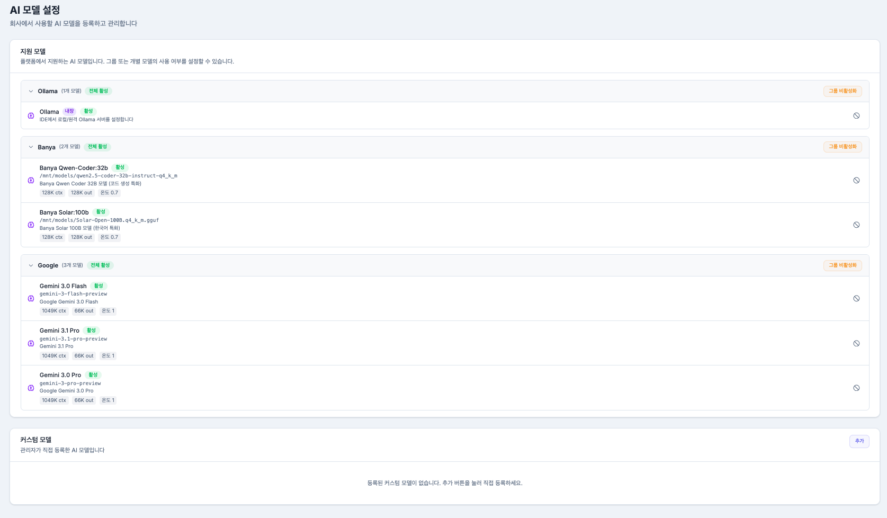
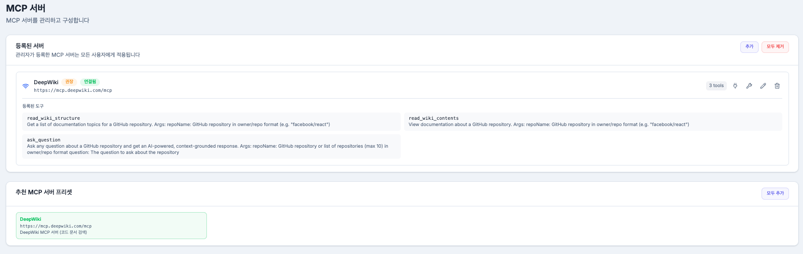
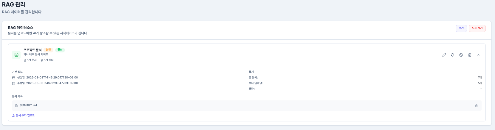
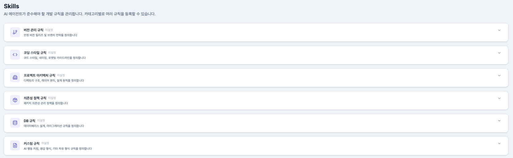
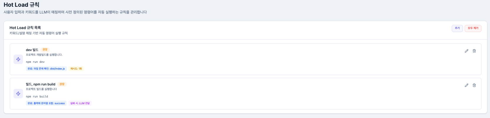
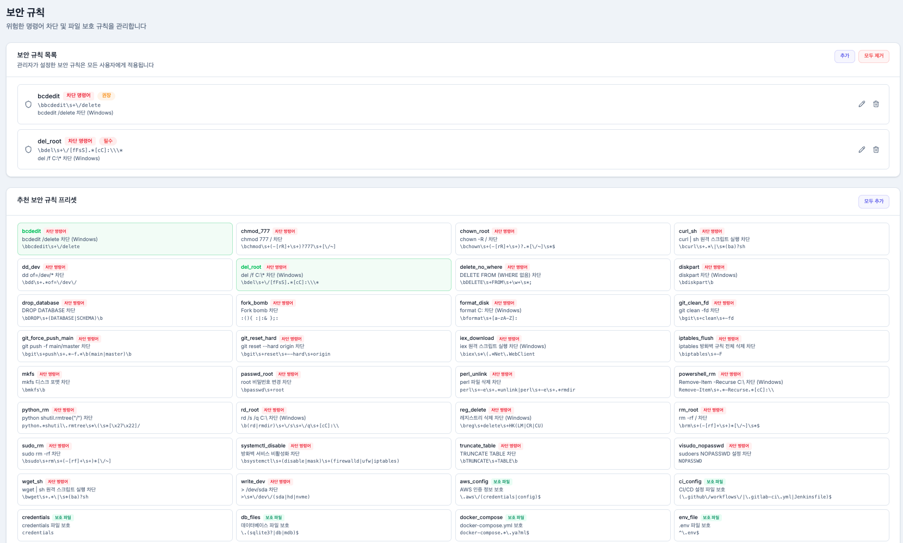
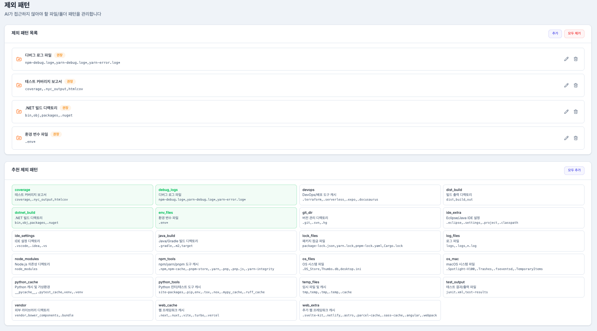
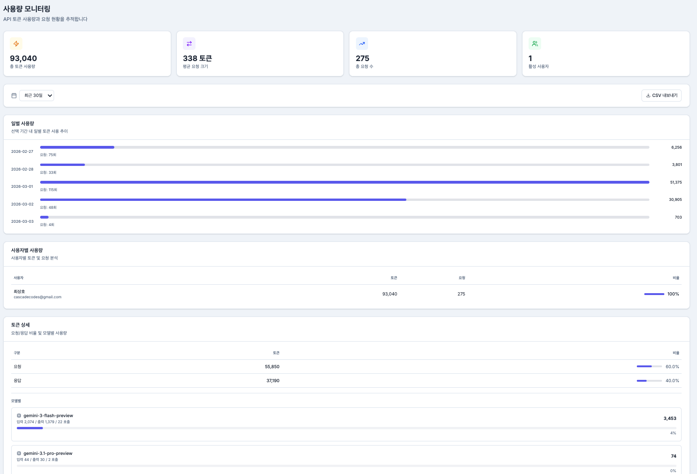

# Admin 주요 기능 상세

## 1. AI 모델 정책 및 라우팅 (Model Governance & Routing)

* **모델 화이트리스트**: 조직에서 검증한 모델만 사용하도록 제한
* **하이브리드 운영**: 클라우드 모델과 온프레미스 모델을 혼합하여 비용과 보안의 균형 유지


**설명 포인트**  
개인의 취향이 아닌 **"회사의 비용/보안 기준"**에 맞는 모델 전략을 운영할 수 있습니다.  
비싼 모델을 무조건 쓰는 것이 아니라, **적재적소에 배분하여 비용을 최적화**합니다.


---

## 2. 도구 및 연동 통제 (Tool Control)

* **허용 도구 관리**: Jira, GitHub 등 사내 승인된 도구만 연동 허용
* **MCP 서버 관리**: 사내 전용 도구(Custom Tools)를 배포하고 관리


**설명 포인트**  
확장성은 유지하되, 검증되지 않은 외부 도구 연결로 인한 **데이터 유출을 방지**합니다.


---

## 3. 조직 지식 관리 (RAG)

* **RAG 소스 관리**: 사내 위키, API 문서 등을 업로드하여 AI가 참고하도록 설정
* **자동 업데이트**: 문서 변경 사항을 주기적으로 인덱싱
* **검색 범위 제어**: 전사 공통 지식과 팀별 특화 지식을 구분하여 적용


**설명 포인트**  
팀 공통 문서를 AI가 학습하여, **"우리 회사 맥락을 아는"** 똑똑한 답변을 제공합니다.


---

## 4. 개발 규칙 및 스킬 (Rules & Skills)

* **코딩 컨벤션 주입**: "변수명은 camelCase로", "JPA 사용 시 지연 로딩 필수" 등 규칙 등록
* **아키텍처 가이드**: 프롬프트에 팀의 아키텍처 원칙을 자동 주입


**설명 포인트**  
개발자가 규칙을 일일이 외우지 않아도, AI가 생성 단계에서 **팀 표준을 준수**합니다.


---

## 5. 키워드 기반 자동 명령 실행 (Hot Load)

* **에러 자동 감지**: 빌드 실패나 런타임 에러 발생 시 AI가 즉시 원인 분석
  * **트리거 기반 실행**: 특정 상황에서 반복되는 작업을 자동으로 수행하도록 설정


**설명 포인트**  
단순한 질의응답을 넘어, **개발 중 발생하는 문제를 능동적으로 해결**합니다.


---

## 6. 보안 및 제외 정책 (Security Policy)

* **금지 명령어**: `rm`, `shutdown`, `chmod` 등 위험 명령어 실행 원천 차단
* **파일 접근 제한**: `.env`, `config/secrets.yml` 등 민감 파일 읽기 차단
* **PII 필터링**: 프롬프트에 포함된 개인정보(전화번호, 이메일 등) 마스킹 처리

* **제외 패턴 관리**: `.git`, `node_modules` 등 불필요한 파일 스캔 방지


**설명 포인트**  
보안팀과 개발팀의 갈등 없이, **시스템 레벨에서 안전 장치**를 마련합니다.


---

## 7. 운영 모니터링 (Monitoring)

* **대시보드**: 일별/월별 토큰 사용량, API 호출 횟수 시각화
* **감사 로그**: 누가 언제 어떤 모델을 사용했는지 이력 추적


**설명 포인트**  
막연한 "감"이 아닌 **"정확한 데이터"**를 기반으로 운영 비용을 예측하고 최적화합니다.

