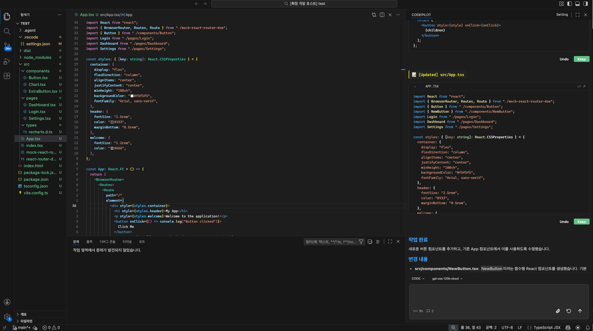

CodePilot IDE는 목적에 따라 세 가지 채팅 모드를 제공합니다. 입력창 좌측 드롭다운에서 언제든지 전환할 수 있습니다.


{/* 이미지 교체 필요: 채팅 입력창의 CODE/ASK/PLAN 드롭다운이 열린 화면 */}

---

## CODE 모드

**파일을 직접 생성·수정·삭제하고 터미널 명령을 실행하는 기본 모드입니다.**

보내기 버튼: 기본 색상 (투명)

### 할 수 있는 것

- 새 파일 생성 (`create_file`)
- 기존 파일 수정 (`update_file`)
- 파일 삭제 (`delete_file`)
- 터미널 명령 실행 (`run_command`) — `npm install`, `git commit` 등
- 코드 탐색 (파일 읽기, 검색)
- 멀티 에이전트 병렬 실행

### 언제 사용하나요?

- 새 기능 구현, 버그 수정, 리팩터링
- 프로젝트 초기 설정 (패키지 설치, 설정 파일 생성)
- 테스트 코드 작성
- 반복적인 코드 패턴 일괄 수정

### 예시

```
src/hooks/ 디렉토리에 useAuth 커스텀 훅을 만들어줘.
JWT 토큰 저장, 로그인/로그아웃, 자동 갱신 기능을 포함해줘.
```

```
모든 API 호출에 에러 처리가 빠진 부분이 있어. src/api/ 디렉토리 전체를 검토하고 try-catch를 추가해줘.
```

<Warning>
CODE 모드에서는 실제 파일이 변경됩니다. 중요한 작업 전에 Git 커밋 상태를 확인하세요. 인라인 Diff 미리보기에서 Accept/Reject로 변경을 제어할 수 있습니다.
</Warning>

---

## ASK 모드

**파일을 수정하지 않고 질문하고 답변을 받는 모드입니다.**

보내기 버튼: 초록색 (`#10B981`)

### 할 수 있는 것

- 코드 설명 및 분석
- 설계 방향 논의
- 오류 원인 분석
- 문서화, 주석 설명 요청
- 코드 리뷰 의견 요청

### 할 수 없는 것

- 파일 생성·수정·삭제
- 터미널 명령 실행

### 언제 사용하나요?

- 낯선 코드베이스를 처음 파악할 때
- 특정 함수나 클래스의 동작을 이해하고 싶을 때
- 구현 방향을 결정하기 전 조언이 필요할 때
- 코드 변경 없이 리뷰 의견만 받고 싶을 때

### 예시

```
@src/core/orchestration/SubAgentLoop.ts 이 파일이 하는 역할을 설명해줘.
주요 메서드와 데이터 흐름 위주로 알려줘.
```

```
현재 인증 구조에서 보안상 취약한 부분이 있으면 알려줘. 수정은 하지 말고 분석만 해줘.
```

---

## PLAN 모드

**파일을 수정하지 않고 구현 계획을 먼저 수립하는 모드입니다.**

보내기 버튼: 파란색 (`#2563EB`)

### 할 수 있는 것

- 코드베이스 읽기 및 분석 (read-only 탐색)
- 구현 계획 Markdown 출력
  - 개요, 분석 결과, 변경 대상 파일, 구현 단계, 리스크, 난이도

### 할 수 없는 것

- 파일 생성·수정·삭제
- 터미널 명령 실행

### 언제 사용하나요?

- 큰 기능을 구현하기 전에 영향 범위를 미리 파악할 때
- 여러 파일에 걸친 변경이 예상될 때
- 팀원과 계획을 공유하고 검토받은 후 실행하고 싶을 때
- AI가 어떻게 구현할지 먼저 확인하고 싶을 때

### 예시

```
결제 시스템을 추가하려고 해. Stripe 연동, 결제 내역 저장, 환불 처리까지 어떻게 구현하면 될까?
```

PLAN 모드는 탐색 후 아래와 같은 형식으로 계획서를 출력합니다:

```markdown
## 구현 계획

### 개요
Stripe 결제 시스템 연동 — 결제, 저장, 환불 3단계 구현

### 분석 결과
- 현재 server/api_router.py에 결제 관련 엔드포인트 없음
- DB 스키마에 payments 테이블 미존재

### 변경 대상 파일
- server/payments.py (신규)
- server/api_router.py (수정)
- db/migrations/0003_add_payments.sql (신규)

### 구현 단계
1. Stripe SDK 설치 및 환경 변수 설정
2. payments.py — 결제/환불 비즈니스 로직 구현
3. api_router.py — /api/payments 엔드포인트 추가
4. DB 마이그레이션 실행

### 리스크
- Stripe Webhook 설정 필요 (서버 공개 URL 필요)

### 난이도
중간 (약 2-3시간 예상)
```

### PLAN → CODE 워크플로우

PLAN 모드의 핵심 장점은 **계획 검토 후 실행**입니다.

<Steps>
  <Step title="PLAN 모드로 계획 수립">
    원하는 기능을 PLAN 모드로 요청합니다. AI가 코드베이스를 탐색하고 계획서를 출력합니다.
  </Step>
  <Step title="계획 검토">
    변경 대상 파일, 구현 단계, 리스크를 확인합니다. 필요하면 추가 질문으로 계획을 조정합니다.
    ```
    3단계에서 api_router.py 말고 payments_router.py를 새로 만드는 게 낫지 않을까?
    ```
  </Step>
  <Step title="CODE 모드로 전환하여 실행">
    모드를 CODE로 전환하고 "이 계획대로 구현해줘"라고 요청합니다. 이전 대화에 플랜 내용이 남아있어 AI가 그대로 실행합니다.
    ```
    위 계획대로 구현해줘.
    ```
  </Step>
</Steps>

<Tip>
**PLAN 모드가 특히 유용한 상황**
- 처음 접하는 프로젝트에서 큰 기능을 추가할 때
- 신규 팀원이 기존 코드에 영향을 미치는 작업을 하기 전
- 코드 리뷰 전에 AI의 구현 방향을 먼저 확인하고 싶을 때
</Tip>

---

## 모드 비교 요약

| | CODE | ASK | PLAN |
|---|------|-----|------|
| 파일 읽기 | ✅ | ✅ | ✅ |
| 파일 생성·수정·삭제 | ✅ | ❌ | ❌ |
| 터미널 명령 실행 | ✅ | ❌ | ❌ |
| 멀티 에이전트 | ✅ | ✅ | ✅ |
| 보내기 버튼 색상 | 기본 | 초록 | 파란 |
| 주요 용도 | 구현 | 질문·분석 | 계획 수립 |
