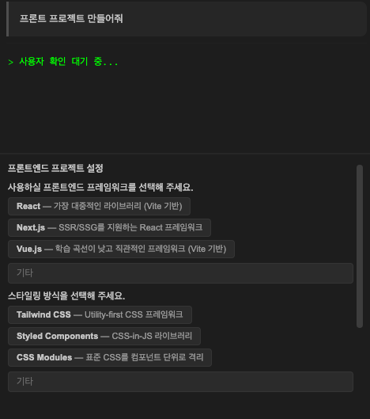

CodePilot IDE는 단순한 AI 채팅 도구를 넘어, **실제 개발 워크플로우 전체를 자동화**하는 강력한 엔진을 내장하고 있습니다.

---

## 0. 네 가지 채팅 모드 (CODE / ASK / PLAN / AGENT)

CodePilot IDE는 목적에 따라 세 가지 모드를 제공합니다. 채팅 입력창 좌측 드롭다운에서 선택합니다.

| 모드 | 보내기 버튼 | 파일 변경 | 주요 용도 |
|------|------------|----------|----------|
| **CODE** | 기본 | ✅ 가능 | 파일 생성·수정·삭제, 명령 실행 |
| **ASK** | 초록 | ❌ 불가 | 질문, 코드 분석, 설계 논의 |
| **PLAN** | 파란 | ❌ 불가 | 구현 계획서 작성 (read-only 탐색) |
| **AGENT** | 검정 | ✅ 가능 | LLM 자율 판단 + 작업 계획 + 워커 생성 |

<Card title="채팅 모드 상세 가이드" icon="layer-group" href="/ide/chat-modes">
  각 모드의 차이, 활용 예시, PLAN → CODE 워크플로우 보기
</Card>

---

## 1. 멀티 LLM 선택 및 하이브리드 운영

하나의 IDE 안에서 **로컬 모델과 클라우드 모델을 자유롭게 전환**하며 사용할 수 있습니다.

* **클라우드 모델**: GPT-4, Claude 3.5 Sonnet 등 고성능 상용 모델을 조직 단위로 등록하여 사용
* **로컬 모델 (Ollama)**: 사내 PC나 서버에 설치한 오픈소스 모델을 직접 연결하여 사용. 외부 네트워크 없이도 동작
* **실시간 모델 전환**: 대화 도중에도 모델을 즉시 변경 가능. 복잡한 코딩은 고성능 모델로, 간단한 질문은 경량 모델로 유연하게 전환

<Info>
**고객 가치**

* 보안이 중요한 프로젝트는 로컬 모델만 사용하여 **데이터 유출 원천 차단**
* 작업 난이도에 따라 모델을 바꿔 쓰며 **비용을 최적화**
</Info>

---

## 2. 작업별 모델 라우팅

사용자가 모델을 직접 고를 필요가 없습니다. **입력의 의도를 자동으로 파악**하여 가장 적합한 모델과 도구를 선택합니다.

* **의도 분류**: 사용자의 입력이 "코드 작업", "명령 실행", "분석", "문서화", "터미널 오류 수정" 중 무엇인지 경량 모델이 먼저 판단
* **자동 모델 배정**: 명령 실행 의도가 감지되면 Command 모델이, 그 외 작업은 메인 모델이 처리
* **도구 자동 호출**: 질문에 답하기 위해 웹 검색, 파일 읽기, Git 조회 등이 필요한 경우 자동으로 적절한 도구를 선택하여 실행
* **전용 슬롯 확장**: 의도 분석 / 명령 실행 / 컨텍스트 압축 / 에러 폴백 / **소스코드 자동추천** 총 5개 슬롯에 독립 모델 지정 가능. 각 용도에 최적화된 모델을 개별 배정하여 비용과 성능 동시에 최적화

<Info>
**고객 가치**

* 개발자는 **모델 선택 고민 없이 작업에만 집중**
* 비싼 모델의 불필요한 호출을 줄여 **운영 비용 절감**
* 소스코드 자동추천에는 가벼운 로컬 모델(예: `starcoder2:3b`)을 배정하여 **응답 속도와 비용 동시 절약**
</Info>

---

## 3. 자동 파일 생성 · 수정 · 삭제

채팅으로 요청하면 AI가 **파일을 직접 만들고, 수정하고, 삭제**합니다. 개발자가 에디터에서 일일이 타이핑할 필요가 없습니다.

* **파일 생성**: "로그인 API 만들어줘"라고 하면, 필요한 파일을 자동으로 생성
* **파일 수정**: 기존 코드를 분석하여 리팩터링하거나 기능을 추가
* **파일 삭제**: 불필요한 파일 정리도 요청 한 마디로 처리
* **멀티파일 동시 편집**: 연관된 여러 파일(컨트롤러, 서비스, DTO 등)을 한 번에 수정. 의존성을 파악하여 호출부까지 함께 변경

<Info>
**고객 가치**

* 반복적인 파일 작업을 자동화하여 **개발 속도 향상**
* 파일 간 의존성 불일치로 인한 **빌드 에러 사전 방지**
</Info>

---

## 4. 인라인 Diff 미리보기 및 승인/거절

AI가 수정한 코드를 **에디터 안에서 바로 비교**하고, 원하는 부분만 선택적으로 적용할 수 있습니다.

* **인라인 Diff 렌더링**: 별도 창을 열 필요 없이, 현재 코드 줄 사이에 추가/삭제된 라인이 색상으로 구분되어 표시
* **스트리밍 Diff**: AI가 코드를 생성하는 동시에 실시간으로 Diff가 그려져, 완료 전에도 미리 검토 가능
* **블록 단위 승인/거절**: 변경 사항을 덩어리(Hunk) 단위로 관리. 마음에 드는 부분만 `Accept`, 나머지는 `Reject`
* **턴 단위 일괄 처리**: "이번 답변에서 만든 변경 전체"를 한 번에 승인하거나 거절 가능
* **영구 저장**: IDE를 재시작해도 아직 승인하지 않은 변경 사항이 사라지지 않고 복원

<Info>
**고객 가치**

* AI의 자동화와 **개발자의 통제권**을 동시에 확보
* "AI가 코드를 망칠까 봐 걱정"하는 불안감 해소
</Info>

---

## 5. 터미널 명령 자동 실행

개발 환경 설정, 빌드, 테스트, 배포 등 **반복적인 터미널 작업을 AI가 대신 수행**합니다.

* **명령어 생성 및 실행**: 사용자의 의도를 파악하여 적절한 쉘 명령어를 만들고 즉시 실행
* **OS 자동 감지**: Windows(PowerShell), macOS(Zsh), Linux(Bash) 등 운영체제에 맞는 문법으로 자동 변환
* **실행 결과 분석**: 터미널 출력(stdout/stderr)을 실시간으로 읽어 성공 여부를 판단하고, 실패 시 원인 분석 및 후속 조치 제안
* **세션 유지**: 일회성 실행이 아니라 터미널 세션을 지속적으로 유지하여, 환경 변수나 작업 디렉토리 상태가 보존

<Info>
**고객 가치**

* 복잡한 명령어를 **외우거나 타이핑할 필요 없음**
* "이 프로젝트 실행해줘"라고 하면 의존성 설치부터 서버 구동까지 알아서 진행
</Info>

---

## 6. 자동 에러 수정 및 재시도

터미널에서 발생하는 에러를 AI가 **실시간으로 감지하고, 스스로 수정을 시도**합니다.

* **다층 에러 처리**:
  * 1차 — 패턴 기반 즉시 수정: `npm install` 누락, 빌드 캐시 오류 등 잘 알려진 에러는 AI 없이 즉시 해결
  * 2차 — AI 분석 수정: 패턴에 매칭되지 않는 에러는 LLM이 로그와 코드를 분석하여 수정 명령 제안
* **에러 분류 엔진**: 에러의 유형(환경 설정, 코드 버그, 의존성 문제 등)을 자동으로 분류하여 적절한 대응 전략 선택
* **재시도 루프**: 설정된 횟수(1~10회)만큼 "수정 → 재실행 → 검증"을 반복. 해결되지 않으면 사용자에게 리포트
* **우선순위 에러 처리**: 터미널에서 오류가 발생하면 AI가 즉시 분석을 시작하여, 개발자가 에러 로그를 읽을 필요 없이 해결책을 제시

<Info>
**고객 가치**

* 에러 발생 시 **구글링 없이 즉시 해결 시도**
* 개발 흐름이 끊기지 않고 **연속적인 작업 가능**
</Info>

---

## 7. 멀티 에이전트 오케스트레이션

복잡한 요청이 들어오면, **여러 전문 에이전트가 동시에 작업을 나눠 처리**합니다. 단순 순차 실행이 아닌 병렬 처리와 결과 통합까지 수행하는 고급 기능입니다.

* **자동 작업 분할**: "쇼핑몰 로그인 기능 만들어줘"라는 큰 요청을 받으면, [DB 스키마 설계], [API 구현], [프론트엔드 UI 작성] 등 세부 작업으로 분할
* **병렬 실행**: 서로 의존성이 없는 작업은 최대 3개의 에이전트가 동시에 처리하여 완료 시간 단축
* **순차 실행**: 의존 관계가 있는 작업(예: DB 설계 완료 후 API 구현)은 앞 단계의 결과를 이어받아 순서대로 진행
* **결과 통합**: 여러 에이전트의 작업 결과를 자동으로 하나의 요약으로 통합
* **실패 복구**: 특정 에이전트의 작업이 실패하면 자동으로 1회 재시도
* **검증 파이프라인**: 모든 작업 완료 후 빌드/테스트를 자동 실행하여 결과물의 품질을 검증. 검증 실패 시 수정 에이전트가 자동 개입

<Info>
**고객 가치**

* 단순 코딩을 넘어 **프로젝트 단위의 복합 작업** 수행 가능
* 작업 분할 → 병렬 처리 → 통합 → 검증까지 **자동화된 개발 파이프라인** 제공
</Info>

---

## 8. 키워드 기반 자동 명령 실행

자주 반복하는 작업을 **키워드에 등록**해두면, 채팅에서 해당 키워드를 입력하는 것만으로 미리 정의된 명령이 즉시 실행됩니다.

* **LLM 의미 매칭**: 정확히 같은 단어가 아니어도, AI가 의미를 파악하여 가장 적합한 등록 명령을 찾아 실행
* **완료 조건 설정**: 명령 실행 후 "종료 코드가 0인지", "출력에 특정 문구가 포함되는지" 등 성공 조건을 지정 가능
* **재시도 및 에스컬레이션**: 실패 시 설정된 횟수만큼 재시도하고, 그래도 실패하면 에러 로그를 AI에게 전달하여 해결 시도

<Info>
**고객 가치**

* 팀의 반복 업무 노하우를 **자동화 규칙으로 자산화**
* "빌드해줘", "테스트 돌려줘" 같은 한 마디로 **복잡한 절차를 즉시 실행**
</Info>

---

## 9. 빌드/테스트 자동 검증

코드를 생성하거나 수정한 뒤, **자동으로 빌드와 테스트를 실행**하여 품질을 검증합니다.

* **프로젝트 타입 감지**: Node.js, Java, Python 등 프로젝트 유형을 자동 인식하여 적절한 검증 명령 실행
* **다단계 검증**: 빌드 → 린트(Lint) → 테스트 순서로 단계적 검증 수행
* **실패 시 자동 수정**: 검증 실패 시 AI가 에러 원인을 분석하고 코드를 수정한 뒤 다시 검증 시도

<Info>
**고객 가치**

* 코드 작성 즉시 검증하여 **버그가 커밋되는 것을 사전 차단**
* "사람이 기억해야 하는 절차"를 **시스템이 지키는 절차로** 전환
</Info>

---

## 10. 보안 가드레일

AI가 작업을 수행하기 전에, **모든 도구 호출을 사전 검증**하여 위험한 동작을 원천 차단합니다.

* **차단 명령어**: `rm -rf /`, `sudo`, `shutdown` 등 시스템 파괴 가능 명령어 실행 방지
* **보호 파일**: `.env`, `.git`, `secrets.yml` 등 민감한 파일의 수정/삭제를 차단
* **숨김 파일**: 특정 파일이나 폴더를 AI가 읽거나 검색할 수 없도록 완전히 은닉
* **프로젝트 외부 접근 차단**: 워크스페이스 밖의 파일에 대한 접근을 원천 차단
* **심볼릭 링크 우회 방지**: 심볼릭 링크를 통한 보호 우회 시도를 탐지하고 차단

<Info>
**고객 가치**

* AI가 아무리 자율적으로 동작해도 **보안 경계를 넘지 못함**
* 개발자가 보안 규칙을 외우지 않아도 **시스템이 자동으로 보호**
</Info>

---

## 11. 소스코드 자동추천 (인라인 Tab 완성)

타이핑하는 순간, AI가 **다음에 올 코드를 실시간으로 예측**하여 회색 텍스트로 제안합니다. Tab 키 하나로 수락하고 개발 흐름을 유지합니다.

* **Ghost Text**: 커서 위치에 AI가 예측한 코드를 반투명하게 표시. Tab 키로 수락, Esc로 무시
* **FIM(Fill-in-the-Middle) 방식**: 커서 앞 80줄 + 뒤 25줄을 동시에 분석하여 삽입될 코드만 정밀하게 예측. 파일 앞뒤 맥락을 모두 고려한 완성
* **열린 탭 컨텍스트**: 현재 파일 외에 에디터에 열려 있는 파일들도 참조하여 프로젝트 전체 맥락에 맞는 완성 제안
* **라우팅 모델에서 자동추천 모델 변경 가능**: 설정 → AI 모델 → 라우팅 모델 슬롯에서 소스코드 자동추천 전용 모델을 별도 지정. 가벼운 로컬 모델(`starcoder2:3b`, `deepseek-coder:1.3b`, `qwen2.5-coder:1.5b-base`)을 지정하면 API 비용 없이 빠른 응답 가능
* **스마트 필터링**: 불필요한 설명문, 전체 파일 재생성, 특수 토큰 등 불량 응답을 자동으로 걸러내고 실제로 삽입할 코드만 반환
* **기본 OFF**: 설정 → 일반에서 토글로 활성화. 활성화 전에는 API 호출 없음

<Info>
**고객 가치**

* GitHub Copilot과 동일한 Ghost Text 경험을 **로컬 모델로도 완전 구현**
* 채팅창 없이 타이핑 흐름을 끊지 않고 **즉각적인 코드 완성**
* 라우팅 모델 설정에서 자동추천 전용 모델을 독립 배정하여 메인 모델 API 비용에 **전혀 영향 없음**
</Info>

---

## 12. 프로젝트 컨텍스트 자동 수집 및 지식 활용

AI가 프로젝트의 구조와 맥락을 **스스로 파악**하여, 정확하고 맞춤화된 코드를 생성합니다.

* **프로젝트 구조 분석**: 디렉토리 구조, import 관계, 사용 기술 스택을 자동 파악
* **RAG 기반 지식 검색**: 조직이 등록한 사내 문서/가이드를 검색하여 답변에 반영
* **프레임워크 감지**: React, Spring Boot, Django 등 사용 중인 프레임워크를 감지하여 해당 프레임워크의 모범 사례를 적용
* **진단 정보 활용**: VS Code가 감지한 문법 오류, 타입 오류 등의 진단(Diagnostic) 정보를 AI에게 전달하여 더 정확한 코드 수정 유도

<Info>
**고객 가치**

* 인터넷의 뻔한 예제가 아닌, **"우리 프로젝트에 맞는"** 코드를 생성
* 신규 입사자도 프로젝트 구조를 빠르게 이해하고 **즉시 개발에 투입** 가능
</Info>

---

## 13. 다음 작업 제안

작업이 완료되면 AI가 **논리적으로 이어질 후속 작업 3가지를 자동 제안**합니다.

* **자동 분석**: 방금 생성·수정한 파일과 사용자 요청을 분석하여 다음 단계를 예측
* **클릭 한 번 실행**: 제안된 버튼을 클릭하면 해당 프롬프트가 자동으로 입력·전송
* **맥락 인지**: "테스트 코드 추가", "API 연동", "스타일 수정" 등 현재 작업에 맞는 구체적 제안

<Info>
**고객 가치**

* "다음에 뭘 해야 하지?" 고민 없이 **자연스러운 개발 흐름 유지**
* 신규 개발자도 **베스트 프랙티스 순서로 작업 진행** 가능
</Info>

---

## 14. AI 질문 (Ask Question)

작업 도중 **AI가 사용자에게 선택지를 제시**하고, 답변에 따라 작업 방향을 결정합니다.

* **팝업 UI**: 채팅 하단에 질문과 선택 버튼이 표시되며, 클릭으로 즉시 답변
* **다중 선택지**: "어떤 프레임워크를 사용할까요?", "테스트도 추가할까요?" 등 상황에 맞는 옵션 제공
* **작업 흐름 유지**: 답변 후 AI가 선택에 따라 즉시 작업을 이어서 진행

<Info>
**고객 가치**

* AI가 **가정하지 않고 확인**하여 원하는 결과물 보장
* 간단한 클릭으로 답변하므로 **작업 흐름 중단 최소화**
</Info>

