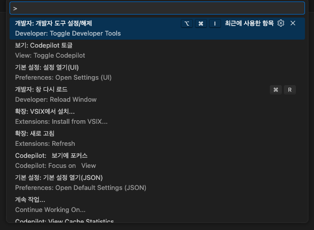
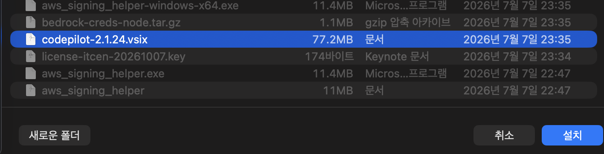
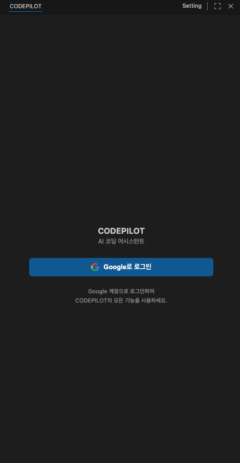

## VSIX 파일로 설치

CodePilot IDE는 `.vsix` 파일을 통해 직접 설치합니다.

<Steps>
  <Step title="VSIX 파일 받기">
    관리자 또는 담당자에게 `.vsix` 설치 파일을 받습니다.
  </Step>
  <Step title="VS Code 명령 팔레트 열기">
    `Ctrl+Shift+P` (macOS: `Cmd+Shift+P`) 를 눌러 명령 팔레트를 엽니다.

    
  </Step>
  <Step title="VSIX에서 설치 선택">
    검색창에 **"vsix"** 를 입력하고 **Extensions: Install from VSIX...** 를 선택합니다.

    
  </Step>
  <Step title="파일 선택">
    파일 탐색기에서 받은 `.vsix` 파일을 선택하고 **Install** 버튼을 클릭합니다.

    설치가 완료되면 VS Code 사이드바에 CodePilot 아이콘이 나타납니다.

    <Info>
    설치 후 VS Code를 재시작하라는 안내가 나오면 **Restart** 를 클릭하세요.
    </Info>
  </Step>
</Steps>

---

## 로그인 및 조직 연결

설치 후 사이드바에서 CodePilot 아이콘을 클릭하면 채팅 패널이 열립니다.

<Steps>
  <Step title="로그인">
    채팅 패널 상단의 **로그인** 버튼을 클릭하면 Google 로그인 화면이 열립니다. Google 계정으로 로그인합니다.

    
  </Step>
  <Step title="조직 연결">
    로그인 후 소속 조직을 선택하거나 조직 코드를 입력합니다.

    조직에 연결되면 관리자가 설정한 **AI 모델 정책**, **보안 규칙**, **코딩 컨벤션**이 자동으로 적용됩니다.

    

    <Tip>
    조직 코드를 모르면 관리자에게 문의하세요. 개인 사용 시에는 조직 없이도 사용할 수 있습니다.
    </Tip>
  </Step>
  <Step title="AI 모델 설정">
    설정 → **AI 모델** 메뉴에서 사용할 LLM을 선택합니다.

    조직 정책에서 허용된 모델만 표시됩니다.

    
  </Step>
</Steps>

---

## Ollama 로컬 모델 연결 (선택)

인터넷 없이 또는 데이터 보안을 위해 로컬 모델을 사용하려면 Ollama를 먼저 설치합니다.

```bash
# macOS / Linux
curl -fsSL https://ollama.com/install.sh | sh

# 모델 다운로드 예시
ollama pull gemma3:12b
ollama pull qwen2.5-coder:7b
```

Ollama 설치 후 CodePilot 설정 → AI 모델 → **Ollama** 선택 시 자동으로 연결됩니다.

<Tip>
소스코드 자동추천(Tab 완성)에는 경량 모델(`starcoder2:3b`, `qwen2.5-coder:1.5b-base`)을 별도로 지정하면 메인 모델의 부하를 줄일 수 있습니다.
</Tip>

---

## 다음 단계

<CardGroup cols={2}>
  <Card title="빠른 시작" icon="rocket" href="/ide/quickstart">
    처음 사용하는 방법, 채팅 예시, 파일 수정 승인 방법
  </Card>
  <Card title="채팅 모드 가이드" icon="comments" href="/ide/chat-modes">
    CODE / ASK / PLAN 모드의 차이와 활용법
  </Card>
</CardGroup>
