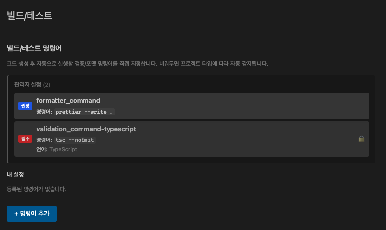
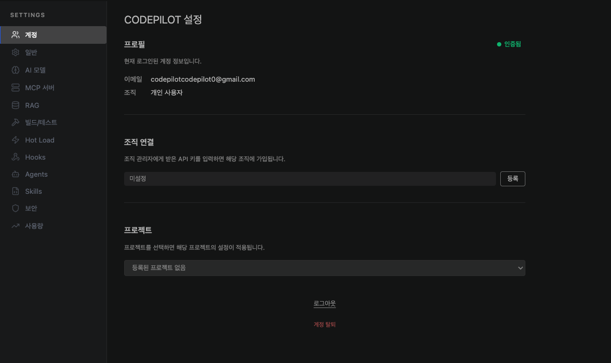
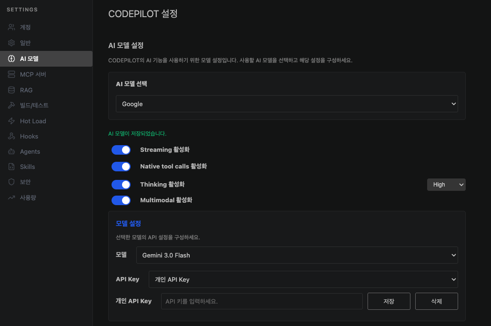

## 시스템 요구사항

| 항목 | 최소 사양 |
|------|-----------|
| VS Code | 1.85.0 이상 |
| OS | Windows 10+, macOS 11+, Linux (Ubuntu 20.04+) |
| 인터넷 연결 | 필요 (클라우드 모델 사용 시) |
| Ollama | 선택 사항 (로컬 모델 사용 시) |

---

## VS Code 마켓플레이스에서 설치

<Steps>
  <Step title="VS Code 확장 패널 열기">
    VS Code 사이드바에서 확장 아이콘을 클릭하거나 `Ctrl+Shift+X` (macOS: `Cmd+Shift+X`)를 누릅니다.
  </Step>
  <Step title="CodePilot 검색">
    검색창에 **"CodePilot"** 또는 **"banya.codepilot"** 을 입력합니다.

    
    {/* 이미지 교체 필요: VS Code 확장 마켓플레이스에서 "codepilot" 검색 결과 화면 — 확장 아이콘, 이름, Install 버튼이 보이는 화면 */}
  </Step>
  <Step title="설치">
    **Install** 버튼을 클릭합니다. 설치가 완료되면 VS Code 사이드바에 CodePilot 아이콘이 나타납니다.
  </Step>
</Steps>

---

## VSIX 파일로 수동 설치

조직 내 사설 배포 환경이나 인터넷이 제한된 환경에서는 `.vsix` 파일로 직접 설치할 수 있습니다.

```bash
# 커맨드 라인으로 설치
code --install-extension codepilot-x.x.x.vsix
```

또는 VS Code 확장 패널 우측 상단 `...` 메뉴 → **Install from VSIX...** 선택.

---

## 로그인 및 조직 연결

설치 후 CodePilot 아이콘을 클릭하면 채팅 패널이 열립니다.

<Steps>
  <Step title="로그인">
    채팅 패널 상단의 **로그인** 버튼을 클릭하고 계정 정보를 입력합니다.

    
    {/* 이미지: CodePilot 채팅 패널에서 로그인 버튼이 보이는 화면 */}
  </Step>
  <Step title="조직 연결">
    로그인 후 소속 조직을 선택합니다. 조직에 연결되면 관리자가 설정한 AI 모델, 보안 정책, 코딩 규칙이 자동으로 적용됩니다.

    <Info>
    조직 코드는 관리자에게 문의하세요. 개인 사용 시에는 조직 없이도 사용할 수 있습니다.
    </Info>
  </Step>
  <Step title="AI 모델 설정">
    설정 → **AI 모델** 메뉴에서 사용할 LLM을 선택합니다. 조직 정책에서 허용된 모델만 표시됩니다.

    
  </Step>
</Steps>

---

## Ollama 로컬 모델 연결 (선택)

인터넷 없이 또는 데이터 보안을 위해 로컬 모델을 사용하려면 Ollama를 먼저 설치합니다.

```bash
# macOS / Linux
curl -fsSL https://ollama.com/install.sh | sh

# 모델 다운로드 예시
ollama pull gemma3:12b
ollama pull qwen2.5-coder:7b
```

Ollama 설치 후 CodePilot 설정 → AI 모델 → **Ollama** 선택 시 자동으로 연결됩니다.

<Tip>
소스코드 자동추천(Tab 완성)에는 경량 모델(`starcoder2:3b`, `qwen2.5-coder:1.5b-base`)을 별도로 지정하면 메인 모델의 부하를 줄일 수 있습니다.
</Tip>

---

## 다음 단계

설치가 완료되었다면 바로 사용해보세요.

<CardGroup cols={2}>
  <Card title="빠른 시작" icon="rocket" href="/ide/quickstart">
    처음 사용하는 방법, 채팅 예시, 파일 수정 승인 방법
  </Card>
  <Card title="채팅 모드 가이드" icon="comments" href="/ide/chat-modes">
    CODE / ASK / PLAN 모드의 차이와 활용법
  </Card>
</CardGroup>
