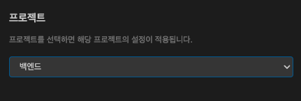
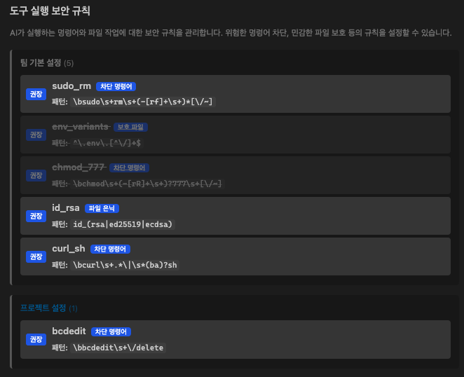

## 프로젝트 설정이란?

조직 관리자가 **프로젝트**를 생성하면, 각 프로젝트마다 독립적인 설정을 적용할 수 있습니다. IDE에서 프로젝트를 선택하면 해당 프로젝트에 맞는 AI 모델, MCP 서버, RAG 지식, 코딩 규칙이 자동으로 적용됩니다.

```
팀 기본 설정 (전사 공통)
    ↓ 상속
프로젝트 설정 (프로젝트 전용으로 덮어쓰기)
    ↓ 병합
IDE에 최종 적용
```

<Info>
프로젝트에 등록된 설정이 없는 카테고리는 **팀 기본 설정이 그대로 적용**됩니다. 프로젝트 설정이 있으면 해당 항목만 덮어씁니다.
</Info>

---

## 프로젝트 선택 방법



1. VS Code 사이드바에서 **설정(⚙️)** 버튼 클릭
2. 상단 **계정** 섹션 아래의 **프로젝트 선택** 드롭다운 확인
3. 원하는 프로젝트를 선택

| 선택 | 효과 |
|------|------|
| **팀 기본 설정** | 조직 전체 공통 설정 적용 |
| **프로젝트 이름** | 해당 프로젝트의 설정이 우선 적용 |

<Tip>
프로젝트를 변경하면 **설정이 즉시 동기화**됩니다. 채팅을 다시 시작하지 않아도 새 프로젝트의 규칙이 반영됩니다.
</Tip>

---

## 프로젝트별로 달라지는 것들

프로젝트를 선택하면 아래 항목들이 프로젝트 전용 설정으로 전환됩니다.

### 보안 규칙



설정 화면에서 보안 규칙이 **팀 기본**과 **프로젝트** 섹션으로 나뉘어 표시됩니다.

| 섹션 | 설명 |
|------|------|
| 팀 기본 규칙 | 관리자가 등록한 전사 공통 보안 규칙 (읽기 전용) |
| 프로젝트 규칙 | 해당 프로젝트에만 추가된 보안 규칙 |

### MCP 서버

MCP 서버 목록도 팀 기본 / 프로젝트로 구분됩니다.

- **팀 기본 서버**: 모든 프로젝트에서 사용 가능
- **프로젝트 서버**: 선택한 프로젝트에서만 활성화

### RAG (지식 검색)

프로젝트를 선택하면 해당 프로젝트에 등록된 RAG 소스가 우선 검색됩니다. 팀 기본 RAG 소스도 함께 참고됩니다.

### 스킬/규칙, 빌드/테스트, 보안 등

모든 설정 카테고리가 프로젝트별로 독립 관리됩니다. 설정 화면에서 팀 기본 설정과 프로젝트 설정이 구분되어 표시됩니다.

---

## 설정 동기화

설정 화면 상단의 **동기화 버튼(🔄)**을 누르면 서버에서 최신 설정을 다시 가져옵니다.

- 관리자가 설정을 변경한 경우
- 프로젝트에 새 멤버가 추가된 경우
- 새 프로젝트가 생성된 경우

동기화 시 프로젝트 목록도 함께 갱신됩니다.

<Tip>
프로젝트 드롭다운에 새 프로젝트가 보이지 않으면 **동기화 버튼**을 눌러보세요.
</Tip>

---

## 자주 묻는 질문

<AccordionGroup>
  <Accordion title="프로젝트를 선택하지 않으면 어떻게 되나요?">
    "팀 기본 설정"이 적용됩니다. 관리자가 등록한 전사 공통 설정이 그대로 사용됩니다.
  </Accordion>
  <Accordion title="프로젝트 목록이 비어 있어요">
    관리자가 아직 프로젝트를 생성하지 않았거나, 해당 프로젝트에 멤버로 추가되지 않은 경우입니다. 관리자에게 문의하세요.
  </Accordion>
  <Accordion title="프로젝트를 바꾸면 채팅 내용이 사라지나요?">
    아닙니다. 채팅 내용은 유지됩니다. 다음 메시지부터 새 프로젝트의 설정이 적용됩니다.
  </Accordion>
  <Accordion title="로컬 규칙과 프로젝트 규칙이 충돌하면?">
    프로젝트 규칙(서버)이 우선합니다. 로컬 규칙은 서버 규칙을 보완하는 용도로 사용하세요.
  </Accordion>
</AccordionGroup>
