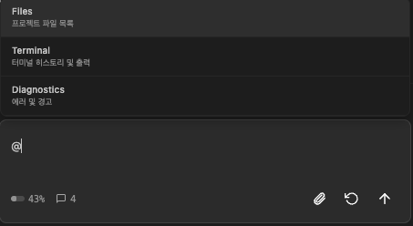
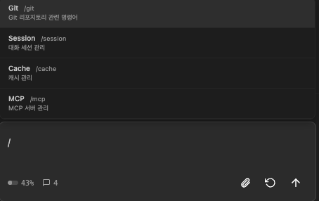
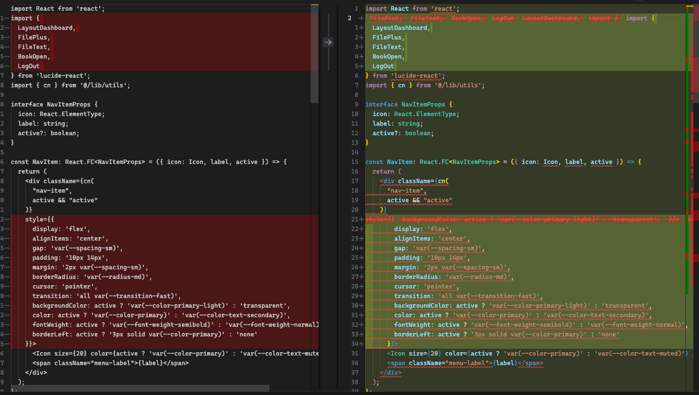
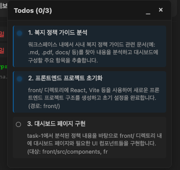

## 채팅 패널 열기

VS Code 사이드바의 CodePilot 아이콘을 클릭하거나 단축키로 패널을 엽니다.


---

## 모드 선택

채팅 입력창 좌측 드롭다운에서 세 가지 모드 중 하나를 선택합니다.

| 모드 | 색상 | 용도 |
|------|------|------|
| **CODE** | 기본 | 파일 생성·수정·삭제, 명령 실행 |
| **ASK** | 초록 | 질문/분석 — 파일 변경 없음 |
| **PLAN** | 파란 | 구현 계획 수립 — 파일 변경 없음 |

<Tip>
처음에는 **ASK** 모드로 코드베이스를 파악하고, **PLAN** 모드로 계획을 세운 뒤, **CODE** 모드로 실행하는 순서를 추천합니다.
</Tip>

---

## 첫 번째 요청 해보기

### 예시 1 — 파일 구조 파악 (ASK 모드)

```
현재 프로젝트 구조를 설명해줘. 주요 디렉토리와 파일의 역할을 알려줘.
```

ASK 모드에서는 코드를 수정하지 않고 질문에만 답변합니다.

---

### 예시 2 — 기능 구현 (CODE 모드)

```
src/components/ 디렉토리에 로그인 폼 컴포넌트를 만들어줘.
이메일과 비밀번호 입력, 제출 버튼, 유효성 검사를 포함해줘.
```

CODE 모드에서는 AI가 파일을 직접 생성·수정합니다.

---

### 예시 3 — 구현 계획 수립 (PLAN 모드)

```
인증 시스템을 추가하고 싶어. JWT 기반으로 로그인/로그아웃/토큰 갱신까지 어떻게 구현하면 될까?
```

PLAN 모드에서는 파일을 수정하지 않고 구현 계획서(Markdown)를 먼저 출력합니다.

---

## @ 메뉴 — 컨텍스트 첨부

입력창에 `@` 를 입력하면 컨텍스트 선택 메뉴가 나타납니다.



| 항목 | 설명 |
|------|------|
| **Files** | 프로젝트 파일을 선택해 AI 컨텍스트에 포함 |
| **Terminal** | 최근 터미널 출력을 참조 |
| **Diagnostics** | 현재 에러·경고 목록을 참조 |

```
@src/api/auth.ts 이 파일에서 토큰 만료 처리 로직을 개선해줘.
```

---

## / 슬래시 명령어

입력창에 `/` 를 입력하면 단축 명령어 메뉴가 나타납니다.



| 카테고리 | 명령어 | 설명 |
|----------|--------|------|
| **Git** | `/git status` | 현재 Git 상태 표시 |
| | `/git diff` | 스테이징 안 된 변경사항 보기 |
| | `/git log` | 최근 커밋 히스토리 |
| | `/git branch` | 로컬/원격 브랜치 목록 |
| **Session** | `/sessions` | 저장된 세션 목록 |
| | `/restore-session` | 이전 세션 복원 |
| | `/delete-session` | 저장된 세션 삭제 |
| **Cache** | `/cache` | 캐시 통계 확인 |
| | `/clear-cache` | 캐시 초기화 |
| | `/compact` | 대화 압축 (토큰 절약) |
| **MCP** | `/mcp` | 연결된 MCP 서버 목록 |

---

## 변경 사항 승인 / 거절

CODE 모드에서 AI가 파일을 수정하면 인라인 Diff 미리보기가 표시됩니다.



- **Accept** — 변경 사항 적용
- **Reject** — 변경 사항 취소
- 파일 상단의 **Accept All / Reject All** — 해당 파일 전체 일괄 처리

<Warning>
자동 실행 설정이 OFF인 경우 AI가 도구를 실행하기 전에 승인 요청이 표시됩니다. 설정 → 일반에서 자동 실행 권한을 조정할 수 있습니다.
</Warning>

---

## 멀티 에이전트 진행 상황 확인

복잡한 요청은 자동으로 여러 서브태스크로 분할되어 병렬 실행됩니다. 채팅 패널 하단의 태스크 큐에서 진행 상황을 실시간으로 확인할 수 있습니다.



```
사내 복지 포털을 만들어줘.
- front/ 디렉토리에 React + TypeScript 프론트엔드
- server/ 디렉토리에 FastAPI 백엔드
- DB는 PostgreSQL 사용
```

위와 같은 요청은 task-1(프론트엔드 구조), task-2(백엔드 API), task-3(통합)으로 자동 분할됩니다.

---

## 다음 단계

<CardGroup cols={2}>
  <Card title="채팅 모드 상세 가이드" icon="layer-group" href="/ide/chat-modes">
    CODE / ASK / PLAN 모드 심층 활용법
  </Card>
  <Card title="주요 기능 전체 보기" icon="list-check" href="/ide/features">
    자동 오류 수정, 보안 가드레일, RAG 등
  </Card>
  <Card title="설정 메뉴 가이드" icon="gear" href="/ide/settings">
    모델 라우팅, 빌드 검증, Hot Load 설정
  </Card>
  <Card title="도입 효과 사례" icon="chart-line" href="/ide/use-cases">
    실제 팀 도입 후 변화 사례
  </Card>
</CardGroup>
