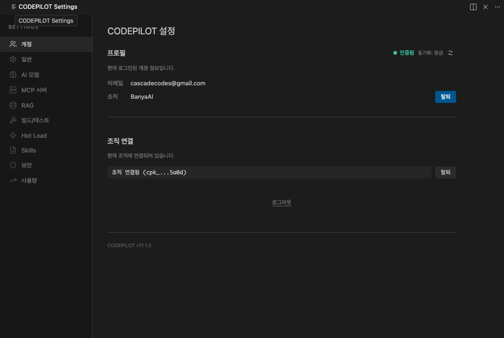
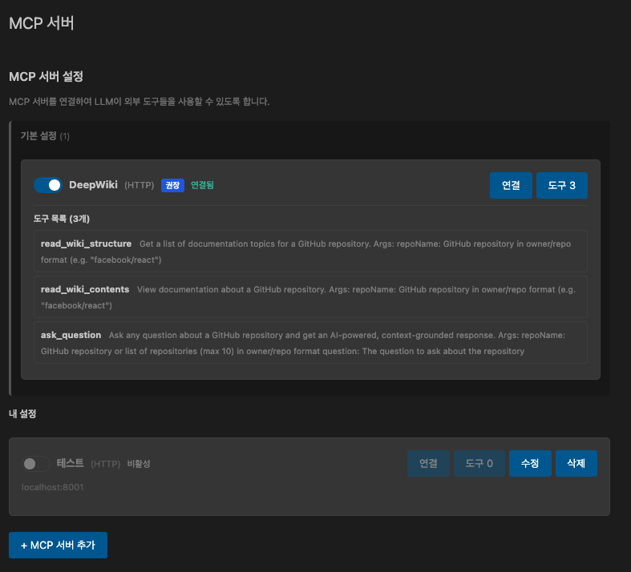
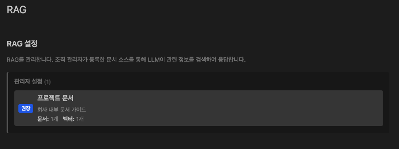
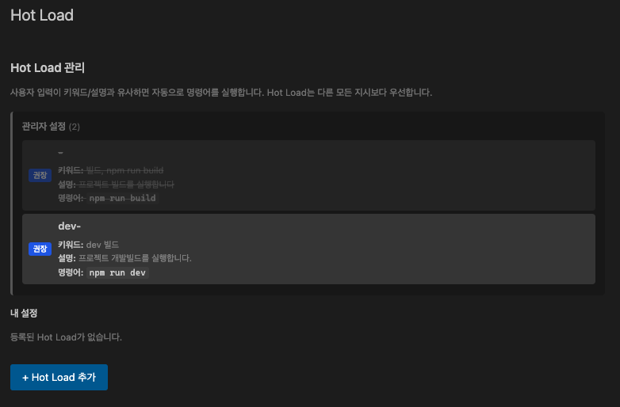
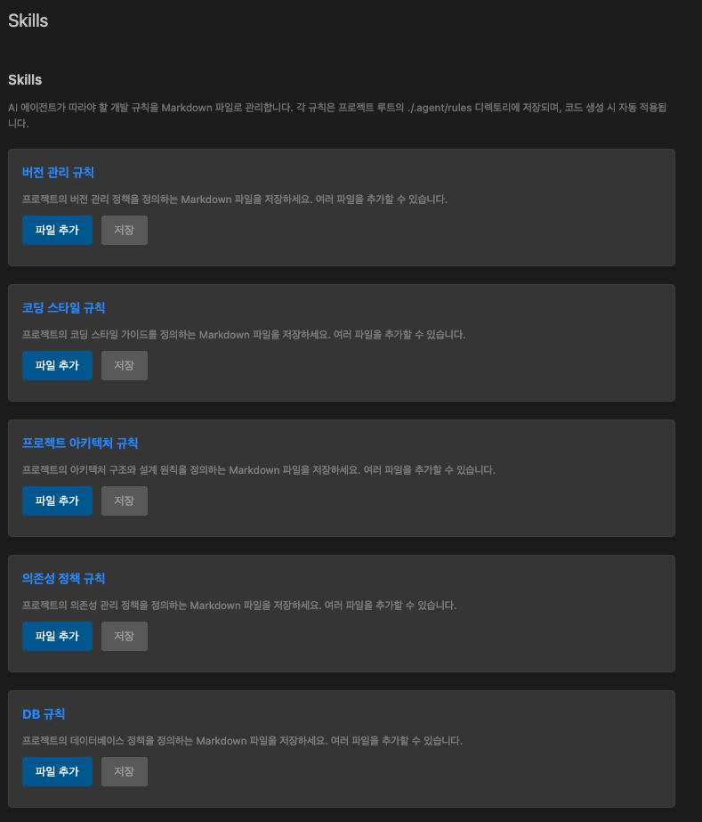
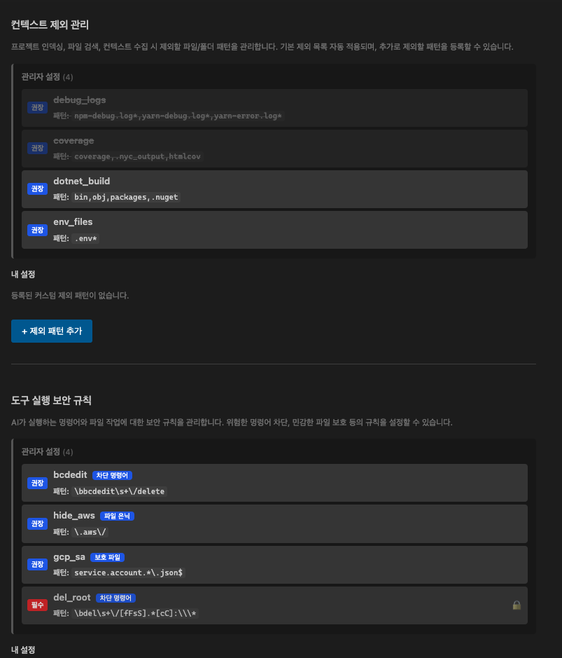

설정 화면은 VS Code 사이드바에서 CodePilot 아이콘을 클릭한 뒤 우측 상단 **설정(⚙️)** 버튼을 누르면 열립니다.



<Info>
조직에 연결된 경우 관리자가 설정한 **강제 정책**은 변경할 수 없습니다. 잠금 표시(🔒)가 있는 항목이 이에 해당합니다.
</Info>

---

## 계정 (Account)


현재 로그인 상태와 소속 조직 정보를 확인하는 화면입니다.

### 주요 항목

| 항목 | 설명 |
|------|------|
| 로그인 이메일 | 현재 로그인된 계정 |
| 조직명 | 연결된 조직 이름. 없으면 "개인 계정"으로 표시 |
| 정책 적용 여부 | 조직 정책이 적용 중인지 표시 |

### 조직 연결 방법

1. **조직 코드 입력** — 관리자에게 받은 코드를 입력하면 해당 조직의 정책이 자동으로 내려옵니다.
2. 연결 후에는 조직이 허용한 AI 모델만 선택 가능하며, 보안 규칙과 코딩 컨벤션이 자동 적용됩니다.

<Tip>
조직을 연결하지 않아도 CodePilot을 사용할 수 있습니다. 다만 개인 API Key를 직접 등록해야 합니다.
</Tip>

---

## 일반 설정 (General)


언어, 테마, 자동 실행 권한 등 기본적인 사용 환경을 설정합니다.

### 언어 / 테마

| 항목 | 설명 |
|------|------|
| 언어 | AI 응답 언어 설정. 한국어(ko), 영어(en) 등 선택 |
| 테마 | 다크 / 라이트 / VS Code 설정 따르기 |

### 자동 실행 권한

CodePilot이 **파일을 수정하거나 명령을 실행하기 전에 확인을 요청**할지 자동으로 실행할지를 설정합니다.

| 설정 | ON일 때 | OFF일 때 |
|------|---------|---------|
| **도구 자동 실행** | AI가 도구(파일 읽기·수정·명령)를 자동 실행 | 매번 실행 전 승인 요청 |
| **파일 자동 업데이트** | 파일 수정 사항을 즉시 자동 적용 | 변경 전 Diff 미리보기 후 Accept/Reject |
| **명령 자동 실행** | `npm install`, `git commit` 등 터미널 명령 자동 실행 | 명령 실행 전 확인 팝업 |

<Warning>
처음 사용하는 경우 **도구 자동 실행과 명령 자동 실행은 OFF** 로 두고 시작하는 것을 권장합니다. AI가 어떤 작업을 하는지 확인하면서 신뢰도를 쌓은 뒤 켜세요.
</Warning>

### 소스코드 자동추천 (Tab 완성)

코드 작성 중 AI가 다음 코드를 **반투명 텍스트(Ghost Text)** 로 미리 보여주는 기능입니다. `Tab` 키를 누르면 제안을 수락합니다.

- **기본값**: OFF
- ON으로 켜려면 이 토글을 활성화하고, AI 모델 설정에서 **소스코드 자동추천 전용 모델**을 지정하세요.

---

## AI 모델 (AI Model)


CodePilot이 사용할 AI 모델을 선택하는 화면입니다.

### 메인 모델 선택

채팅에서 사용할 기본 AI 모델을 선택합니다.

| 구분 | 예시 | 특징 |
|------|------|------|
| 클라우드 모델 | GPT-4o, Claude 3.5 Sonnet, Gemini 2.0 | 고성능, 인터넷 필요, 비용 발생 |
| 로컬 모델 (Ollama) | gemma3:12b, qwen2.5-coder:7b | 무료, 오프라인 가능, 속도는 PC 사양에 따라 다름 |

<Tip>
조직에 연결된 경우 관리자가 허용한 모델만 목록에 표시됩니다.
</Tip>

### 개인 API Key 등록

조직 모델 외에 개인 API Key를 등록하면 직접 비용을 내고 사용할 수 있습니다.

1. OpenAI / Anthropic / Google 등 제공사에서 API Key를 발급받습니다.
2. 설정 → AI 모델 → **개인 API Key** 항목에 입력합니다.

### 라우팅 모델 슬롯 (고급)

CodePilot은 작업 종류에 따라 **서로 다른 모델을 자동으로 선택**합니다. 각 용도별로 별도 모델을 지정할 수 있습니다.

| 슬롯 | 역할 | 권장 모델 |
|------|------|-----------|
| **의도 분석** | 사용자 요청이 코드 작업인지, 질문인지 분류 | 경량 모델 (빠를수록 좋음) |
| **명령 실행** | 터미널 명령 생성 및 실행 | 메인 모델 |
| **컨텍스트 압축** | 대화가 길어질 때 요약 | 경량 모델 |
| **에러 폴백** | 메인 모델 실패 시 대체 모델 | 메인 모델과 다른 것 |
| **소스코드 자동추천** | Ghost Text 인라인 완성 | `starcoder2:3b`, `qwen2.5-coder:1.5b-base` |

<Tip>
소스코드 자동추천 슬롯에 Ollama 경량 모델을 지정하면 타이핑할 때마다 API 비용 없이 빠른 자동완성을 사용할 수 있습니다.
</Tip>

---

## 도구 연동 / MCP



외부 서비스(GitHub, Jira, DB 등)를 CodePilot에 연결하는 화면입니다.

### MCP란?

**Model Context Protocol** — AI가 외부 시스템과 직접 대화할 수 있게 해주는 표준 프로토콜입니다.
예를 들어 GitHub MCP를 연결하면 "이 PR의 코드 리뷰해줘" 같은 요청이 바로 실행됩니다.

### MCP 서버 추가 방법

1. 설정 → **도구 연동** 탭으로 이동
2. **MCP 서버 추가** 버튼 클릭
3. 서버 이름, 명령어(command), 인수(args) 입력

```json
예시 — GitHub MCP 서버
{
  "name": "github",
  "command": "npx",
  "args": ["-y", "@modelcontextprotocol/server-github"],
  "env": {
    "GITHUB_PERSONAL_ACCESS_TOKEN": "your-token-here"
  }
}
```

<Info>
조직 관리자가 MCP 서버를 사전 등록한 경우, 별도 설정 없이 자동으로 사용할 수 있습니다.
</Info>

---

## 지식 검색 (RAG)



사내 문서(위키, API 문서, 정책서 등)를 AI가 검색해 참고할 수 있도록 연결하는 기능입니다.

### RAG가 왜 필요한가요?

일반 AI는 우리 회사만의 규칙, 내부 API, 코딩 컨벤션을 모릅니다. RAG를 연결하면 AI가 사내 문서를 직접 참고해서 **우리 팀에 맞는 코드**를 생성합니다.

**예시**: 회사 API 문서를 연결하면 AI가 정확한 엔드포인트와 파라미터를 알고 코드를 작성합니다.

### 연결 방법

1. 관리자가 Admin 콘솔에서 문서를 업로드하고 인덱싱합니다.
2. IDE 설정 → **지식 검색** 탭에서 프로젝트별 검색 범위를 확인할 수 있습니다.
3. 채팅 시 자동으로 관련 문서를 검색해 응답에 반영합니다.

<Tip>
별도 설정 없이 조직 RAG가 연결된 경우 채팅에서 자동으로 활성화됩니다.
</Tip>

---

## 빌드/테스트 (Build & Test)


코드 수정 후 자동으로 실행할 검증 명령어를 설정합니다. AI가 파일을 생성·수정한 뒤 이 명령어를 실행해 오류가 없는지 스스로 확인합니다.

### 설정 방법

1. 설정 → **빌드/테스트** 탭으로 이동
2. **명령어 추가** 버튼 클릭
3. 실행할 명령어를 입력

### 자주 사용하는 명령어 예시

| 프로젝트 종류 | 명령어 |
|--------------|--------|
| Node.js (테스트) | `npm test` |
| Node.js (린트) | `npm run lint` |
| Node.js (빌드) | `npm run build` |
| Python | `pytest` |
| Java (Maven) | `mvn verify` |
| Java (Gradle) | `./gradlew test` |

### 자동 오류 수정 흐름

```
AI가 코드 작성
    ↓
빌드/테스트 명령 자동 실행
    ↓
오류 발생 → AI가 오류 내용 분석 → 자동 수정 시도
    ↓
다시 검증 → 통과 시 완료
```

<Info>
최대 재시도 횟수는 설정에서 조정할 수 있습니다 (기본값: 3회).
</Info>

---

## 자동 대응 (Hot Load)



특정 상황이 발생했을 때 AI가 자동으로 특정 작업을 수행하도록 규칙을 등록하는 기능입니다.

### 어떤 상황에서 사용하나요?

- 빌드 실패 시 자동으로 "린트 실행해줘" 수행
- 특정 파일이 수정될 때마다 자동으로 관련 테스트 실행
- 에러 로그가 쌓일 때 자동으로 분석 시작

### 규칙 등록 방법

1. 설정 → **자동 대응** 탭으로 이동
2. **규칙 추가** 버튼 클릭
3. **트리거 조건**과 **실행할 작업** 입력

```
트리거: "npm run build" 명령 실패
작업:   "린트 오류를 찾아서 수정해줘"
```

<Tip>
조직 관리자가 핫로드 규칙을 공통으로 등록해두면 모든 팀원이 동일한 자동화를 공유합니다.
</Tip>

---

## 스킬 및 규칙 (Skills)



AI가 코드를 작성할 때 항상 따라야 하는 **팀 규칙**을 등록하는 화면입니다.

### 스킬/규칙이란?

AI에게 "우리 팀은 이렇게 코드를 작성한다"는 지침을 알려주는 것입니다.

**예시**:
- "함수명은 camelCase를 사용할 것"
- "API 응답은 반드시 Result 래퍼 객체로 감쌀 것"
- "JPA Entity는 FetchType.LAZY를 기본으로 사용할 것"
- "에러 처리는 GlobalExceptionHandler에서 일괄 처리할 것"

### 종류

| 종류 | 설명 |
|------|------|
| **로컬 규칙** | 내 PC에서만 적용. 개인 취향이나 프로젝트별 규칙 |
| **조직 규칙 (서버)** | 관리자가 등록. 모든 팀원에게 자동 적용 |
| **스킬** | 더 복잡한 작업 흐름 정의 (예: "PR 생성 시 자동으로 코드 리뷰 요청") |

### 로컬 규칙 추가 방법

1. 설정 → **스킬 및 규칙** 탭으로 이동
2. **규칙 추가** 클릭
3. 자연어로 규칙을 입력

```
예시 규칙:
모든 React 컴포넌트는 함수형으로 작성하고,
Props는 interface로 타입을 정의해야 한다.
```

<Info>
조직 규칙은 관리자가 Admin 콘솔에서 등록합니다. 개인이 수정하거나 끌 수 없습니다.
</Info>

---

## 보안 (Security)



AI가 실행하면 안 되는 명령어와 접근하면 안 되는 파일/폴더를 지정합니다.

### 차단 목록 (Command Blocklist)

AI가 절대 실행하지 못하도록 막을 명령어 패턴을 등록합니다.

**기본으로 차단되는 것들:**
- `rm -rf /` — 시스템 전체 삭제
- `sudo` — 관리자 권한 명령
- `shutdown`, `reboot` — 시스템 종료

**직접 추가하는 예시:**
```
DROP TABLE     ← 데이터베이스 테이블 삭제
git push --force  ← 강제 푸시
chmod 777      ← 파일 권한 전체 개방
```

### 제외 목록 (File Exclusion)

AI가 읽거나 수정하지 못하도록 막을 파일/폴더를 지정합니다.

**반드시 추가해야 하는 것들:**
```
.env              ← API Key, 비밀번호 등 환경 변수
.env.local
secrets/          ← 인증서, 비밀 키 파일이 있는 폴더
config/secrets.yml
```

**선택적으로 추가하는 것들:**
```
node_modules/     ← 불필요한 스캔 방지 (성능 향상)
.git/             ← Git 내부 파일 보호
dist/             ← 빌드 결과물
```

### 추가 방법

1. 설정 → **보안** 탭으로 이동
2. **차단 목록** 또는 **제외 목록** 항목에서 **추가** 버튼 클릭
3. 패턴 또는 경로를 입력하고 저장

<Warning>
보안 설정은 AI가 실수로 중요한 파일을 수정하거나 위험한 명령을 실행하는 것을 막는 마지막 안전장치입니다. `.env` 파일은 반드시 제외 목록에 추가하세요.
</Warning>
